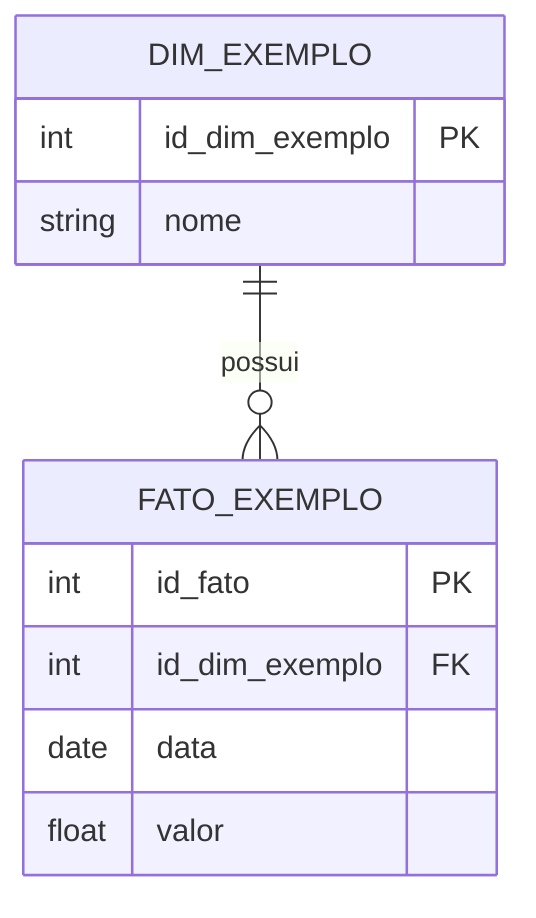

# Diagrama do Modelo Dimensional

*(preencher após definir o esquema com base nos dados recebidos — ver convenções em [README.md](README.md))*

Granularidade da tabela fato: *a definir*.

```mermaid
erDiagram
    %% Exemplo de esqueleto — substituir pelas entidades reais
    FATO_EXEMPLO {
        int id_fato PK
        int id_dim_exemplo FK
        date data
        float valor
    }
    DIM_EXEMPLO {
        int id_dim_exemplo PK
        string nome
    }

    DIM_EXEMPLO ||--o{ FATO_EXEMPLO : possui
```
