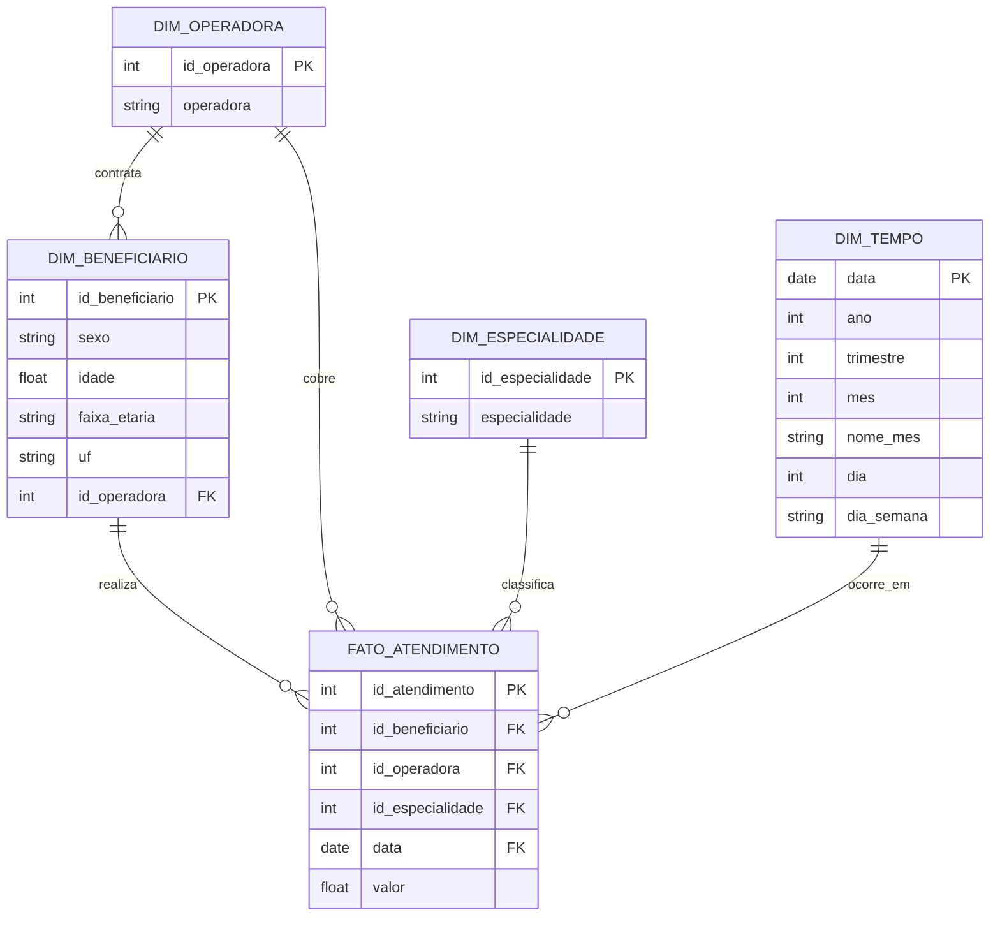

# Diagrama do Modelo Dimensional

Esquema em **estrela**, com a dimensão de operadora desnormalizada diretamente na fato (ver
justificativa abaixo).

Granularidade da tabela fato: **1 linha por atendimento** (`id_atendimento`).

## Decisões de modelagem

- **Grão da fato:** um atendimento individual — permite qualquer agregação pedida (por
  especialidade, operadora, UF, mês, beneficiário) sem perda de detalhe.
- **`id_operadora` desnormalizado na fato:** no dado de origem, a operadora é um atributo do
  *beneficiário* (`Beneficiarios.csv`), não do atendimento. Um star schema puro ligaria
  `fato_atendimento → dim_beneficiario → dim_operadora` (snowflake). Optei por copiar
  `id_operadora` para dentro da fato durante o ETL para que "Gastos por operadora" (indicador
  pedido no dashboard) seja um filtro/agrupamento direto na fato, sem *forçar* o Power BI a
  atravessar a dimensão de beneficiário — mais simples de modelar e mais performático, ao custo
  de uma pequena redundância (o `id_operadora` também permanece em `dim_beneficiario`, para
  quem quiser navegar beneficiário → operadora).
- **`dim_tempo`:** contém apenas as datas efetivamente presentes em `fato_atendimento` (dimensão
  "enxuta", não um calendário completo desde 1900) — atende ao filtro de período e à visualização
  de evolução mensal pedidos no dashboard.
- **Registros sentinela (`-1`)** em `dim_beneficiario` e `dim_operadora` absorvem as FKs
  inválidas/órfãs encontradas no tratamento (ver notebook), preservando a integridade
  referencial sem descartar o valor financeiro dos atendimentos correspondentes.
- **`faixa_etaria`** foi adicionada a `dim_beneficiario` como atributo derivado, para permitir
  segmentação etária no dashboard mesmo com ~5% de idades ausentes/inválidas (agrupadas em
  "Não Informada").
